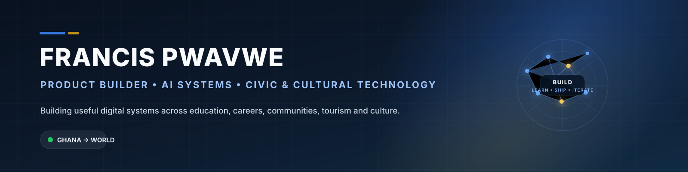

# Hey, I'm Francis Pwavwe 👋🏾

### Product Builder · AI Systems · Civic & Cultural Technology

I turn messy real-world problems into usable digital products — especially across
**education, careers, communities, tourism, civic systems and indigenous-language technology**.

I'm a Tourism Management graduate who somehow wandered into product development and never left. 😅
Most of my work sits at the intersection of **people, systems, design and software**.

---

## 🚧 What I'm building now

| Project | What it is | Explore |
|---|---|---|
| **Folivera** | Career infrastructure for CV intelligence, job readiness and portable Talent Passports. | [folivera.pwavwe.com](https://folivera.pwavwe.com) |
| **Indigen World** | A cultural-technology ecosystem for indigenous-language preservation, learning, storytelling and creator participation. | [Repository](https://github.com/pwavwef-web/indigen-world) |
| **Comitia** | A social/community product I'm actively prototyping and refining. | [comitia.pwavwe.com](https://comitia.pwavwe.com) |
| **AZ GPA Calculator** | Student-focused GPA/CGPA planning tools built around real university grading systems. | [Repository](https://github.com/pwavwef-web/az-gpa-calculator) |
| **Pwavwe Build** | My home for experiments, prototypes and shipped digital products. | [build.pwavwe.com](https://build.pwavwe.com) |

## 🧠 How I like to build

- **Problem first, technology second.** A fancy stack cannot rescue a pointless product.
- **AI should be infrastructure, not decoration.** I care about reliability, grounding, evaluation and responsible product behaviour.
- **Ship, observe, improve.** I would rather test a real workflow than endlessly debate a perfect mock-up.
- **Design for ordinary people.** Good software should reduce cognitive load, not add another manual to someone's life.
- **Local context matters.** Products built for African users should not treat bandwidth, accessibility, language or institutional realities as edge cases.

## 🧰 Toolkit

  

**Frontend:** React · TypeScript · JavaScript · Flutter  
**Backend & cloud:** Firebase Auth · Firestore · Cloud Functions · Hosting · Node.js  
**Product:** Figma · GitHub · rapid prototyping · product research · workflow design  
**Current technical interest:** provider-independent AI systems, grounded generation, evaluation and trustworthy AI-assisted product experiences

## 🧩 Selected systems I've worked on

Beyond the projects above, I've built or contributed to products for:

- digital elections and polling infrastructure
- university media and publishing workflows
- student academic tools
- CV and ATS intelligence
- transport and customer-support systems
- hospitality and tourism operations
- physical-digital access systems

That variety is intentional. I like learning a domain deeply enough to turn its annoying little problems into software.

## 🌍 What I care about

Technology should do more than look impressive in a demo.

I want to build systems that **expand access, preserve identity, improve decision-making and make complicated processes easier for ordinary people to navigate** — particularly in contexts that mainstream technology often overlooks.

---

### Building from Ghana for the world 🌍

**Open to product collaborations, ambitious experiments and interesting problems.**

